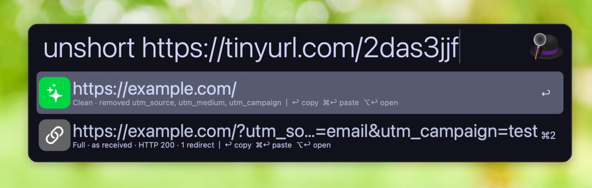

# Unshorten

An Alfred workflow that resolves shortlinks to their final URL and offers a copy with the tracking parameters removed.

DNS filters, like Pi-hole and NextDNS, block most link shorteners. Sometimes you still need to resolve a shortlink to see where it's going. This workflow follows the redirects, expands the shortlink, optionally cleans the tracking parameters off it, and lets you copy, paste, or open the result.



## What it does

Type `unshort`, paste a link, and the resolved URL appears as a result row. When the destination carries tracking parameters, you get two rows.

- **Clean** has `utm_*`, `fbclid`, `gclid`, and friends stripped out. The subtitle says which ones were removed.
- **Full** is the URL exactly as the server sent it.

On either row, Enter copies the URL, Cmd-Enter pastes it into the frontmost app, and Option-Enter opens it in your browser.

A few things it handles along the way.

- Only headers are fetched, unless the server refuses `HEAD`, in which case it retries once with `GET` and throws the body away. Nothing is rendered either way, so the page's scripts never run.
- DNS lookups go over DNS-over-HTTPS, so shortener domains resolve even when a DNS filter such as Pi-hole or NextDNS blocks them. The resolver is a setting. Clear it to use your system DNS.
- Links that wrap the destination in a query parameter (Google's `url?q=`, newsletter click trackers) are decoded locally, so the tracker is never contacted.
- If you paste a whole sentence, it picks out the first link.

## Install

Download `Unshorten.alfredworkflow` from the [latest release](https://github.com/bumpynux/alfred-unshorten/releases/latest) and double-click it. Alfred will ask about the DNS-over-HTTPS resolver on import. The default is Cloudflare, and it works as is.

## Try it

These are real links that resolve to pages with tracking parameters, so you can see both rows.

```
https://tinyurl.com/2das3jjf
https://tinyurl.com/26c7hu7s
```

## Building from source

The script lives in `src/unshorten.sh` so it's readable. `build.sh` embeds it into `info.plist` and zips the bundle.

```
./build.sh
open Unshorten.alfredworkflow
```

## Notes

The list of tracking parameters is in [`src/tracking-params.txt`](src/tracking-params.txt), one name per line, with a trailing `*` for prefixes like `utm_*`. Affiliate tags such as Amazon's `tag` are left alone on purpose, since they credit whoever shared the link rather than track you. If you find a tracking parameter it misses, please let me know by opening an [issue](https://github.com/bumpynux/alfred-unshorten/issues/new) or a [pull request](https://github.com/bumpynux/alfred-unshorten/pulls).

If something else on your Mac already strips tracking parameters from copied links, you will mostly see the Full row. The workflow still does the resolving.
